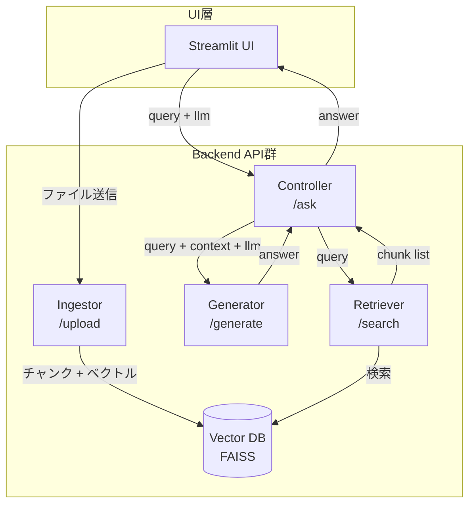

# RAG Azure PoC

本プロジェクトは、Azure上で動作させることを想定した **RAG（Retrieval-Augmented Generation）構成のPoC** です。すべての機能を疎結合なAPIで構成し、再現性・移植性・可視性に優れた構造となっています。

---

## 💻 開発環境

本プロジェクトは以下の環境で動作確認されています：

- macOS (Apple M2)
- Docker Desktop 4.21.1 (114176)
- Python 3.11（ベースイメージ）
- VSCode + dev container（任意）
---
## 🔧 構成概要

本PoCは以下のマイクロサービスで構成されています：

| サービス名    | 説明                             | ポート |
|--------------|----------------------------------|--------|
| `retriever`  | クエリから類似チャンクを検索      | 8001   |
| `generator`  | クエリ＋文脈から回答を生成        | 8002   |
| `vector-db`  | ベクトル登録・検索（FAISS等想定） | 8003   |
| `controller` | 全体制御API。retriever→generator連携 | 8004   |
| `ingestor`   | 文書の取り込み                       | 8005 |
| `ui`         | Streamlitによる問い合わせUI       | 8501   |

---

## 🚀 クイックスタート

### 1. コンテナ起動

```bash
docker compose up --build
```

起動後、以下にアクセス：

UI: http://localhost:8501


### 2. 例：curlで直接APIを叩く

```bash
curl -X POST http://localhost:8004/ask \
  -H "Content-Type: application/json" \
  -d '{"query": "乾電池の捨て方"}'
```
---
## 使用技術

- Python 3.11 + FastAPI
- Streamlit
- Docker / docker-compose
- FAISS（予定）
- Hugging Face Transformers（予定）
---
## 📝 今後の実装予定
- vector-db にFAISSを組み込み、チャンクベクトルの登録・検索を実装
- エンベディングモデルや生成モデルの選択切り替え機能（configで制御）
- Azure VMへの移植構成整備（App Gatewayやセキュリティを考慮）
- 精度評価用のベンチマークデータ整備
---
## 📁 ディレクトリ構成

```text
rag-azure-poc/
├── retriever/
├── generator/
├── ingestor/
├── vector-db/
├── controller/
├── ui/
├── docker-compose.yml
├── sample_document.pdf # 横浜市のゴミ出しガイドブックです。RAGに投入するサンプル文書として
└── README.md
```
---
## 📐 アーキテクチャ構成図（Mermaid）


---
## 📤 コンテナ間のAPI仕様まとめ表（Mini OpenAPI風）

| From       | To         | Method | Path        | Request JSON                                          | Response JSON                           |
| ---------- | ---------- | ------ | ----------- | ----------------------------------------------------- | --------------------------------------- |
| UI         | Controller | POST   | `/ask`      | `{"query": "...", "llm": "gemini"}`                   | `{"answer": "..."}`                     |
| Controller | Retriever  | POST   | `/search`   | `{"query": "..."}`                                    | `{"chunks": [...]}`                     |
| Controller | Generator  | POST   | `/generate` | `{"query": "...", "context": "...", "llm": "gemini"}` | `{"answer": "..."}`                     |
| UI         | Ingestor   | POST   | `/upload`   | multipart file                                        | `{"filename": "...", "message": "..."}` |

---
## 🧱 コンテナ機能一覧表

| コンテナ         | ポート  | 役割               | 主なエンドポイント   |
| ------------ | ---- | ---------------- | ----------- |
| `ui`         | 8501 | ユーザー向けUI         | -           |
| `controller` | 8004 | ルーティングと統合処理      | `/ask`      |
| `retriever`  | 8001 | チャンク検索           | `/search`   |
| `generator`  | 8002 | 回答生成（LLM切替対応）    | `/generate` |
| `vector-db`  | 8003 | ベクトル格納・検索（FAISS） | 内部利用        |
| `ingester`   | 8005 | ファイルアップロード＋整形    | `/upload`   |

## 🔐 .env ファイルの取り扱い
このプロジェクトでは、APIキーやトークンなどの機密情報を .env ファイルで管理しています。

- env は セキュリティ上の理由で Git 管理から除外されています。
- .gitignore に以下のように記述されています：

```text
# 環境変数ファイル（機密情報）
*.env
```
代わりに、雛形として .env.example をプロジェクトに含めています。

```text
# .env.example の例
GOOGLE_API_KEY=your_api_key_here
```
